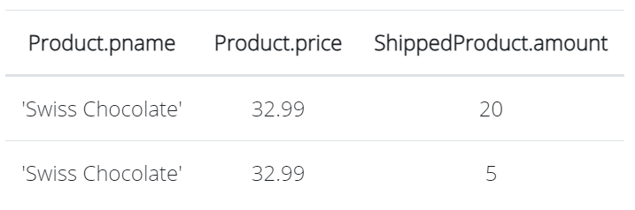

# COSC 304 - Introduction to Database Systems Lab 1: Querying using Relational Algebra

## [RelaX - Online Relational Algebra Tool](https://dbis-uibk.github.io/relax/)

[RelaX](https://dbis-uibk.github.io/relax/) is an online relational algebra tool that we will use for the assignments. It allows entering relational algebra expressions and executing them to get results. The data set can be loaded from a GitHub Gist including the [Bookstore data set GIST: 367f41bb51110ef3c84bb5f906f2fb87](https://gist.github.com/rlawrenc/367f41bb51110ef3c84bb5f906f2fb87) used for sample relational algebra queries in this lab, and the [Shipment database GIST: 585ee1836abb142a461d137e12dd14a3](https://gist.github.com/rlawrenc/585ee1836abb142a461d137e12dd14a3) used in the lab questions.
 

## Relational Algebra Questions (10 marks - 2 marks each)

Given the following relational schema, write queries in **relational algebra** to answer the English questions using the <a href="http://dbis-uibk.github.io/relax/">online relational algebra tool</a>. The database definition is available as a [Shipment database GIST: 585ee1836abb142a461d137e12dd14a3](https://gist.github.com/rlawrenc/585ee1836abb142a461d137e12dd14a3). The database is also available as an <a href="Shipment.sql">DDL file.</a>

<pre>
Customer(<i>cid:</i> integer, <i>cname:</i> string, <i>address:</i> string, <i>city:</i> string, <i>state:</i> string)
Product(<i>pid:</i> integer, <i>pname:</i> string, <i>price:</i> currency, <i>inventory:</i> integer)
Shipment(<i>sid:</i> integer, <i>cid:</i> integer, <i>shipdate:</i> Date/Time)
ShippedProduct(<i>sid:</i> integer, <i>pid:</i> integer, <i>amount:</i> integer)
</pre>

<ol>
<li> Return the product id and amount for each ShippedProduct where the amount was less than or equal to <tt>5</tt> or greater than <tt>30</tt>. Expected output: </li>

<li> Return the shipment id, product id, shipped amount, product name, and inventory for products that have any past shipment amount more than the current inventory.  Expected output: </li>

<li> Return a list of all the products (show the product name, price, shipped amount) that have been in a shipment between <tt>June 1, 2012</tt> and <tt>December 21, 2014</tt>. The product price must be less than <tt>$40</tt> and the shipped amount > <tt>4</tt>. 
  Note: To enter a date such as <tt>2024-09-23</tt>, the syntax is <tt>Date('2024-09-23')</tt>.
  Expected output: </li>

<li> Return the product name, current inventory, shipment amount, and customer state where the product had a shipment of an amount at least 30% of its current inventory and the customer state was either <tt>'CA'</tt> or <tt>'IA'</tt>. Expected output: </li>

<li> Return a list of products (id, name, price) where the product has not been in any shipments or the product price is greater than <tt>$5</tt> and has been shipped to a customer in <tt>'NJ'</tt>. Expected output:  Note: Order does not matter for the output.</li>
</ol>

