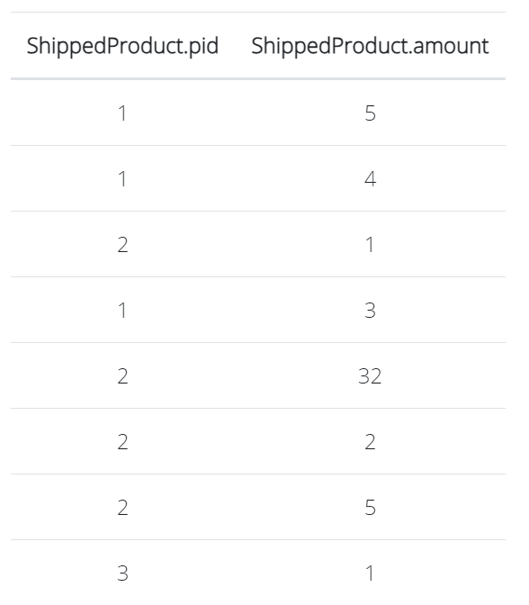
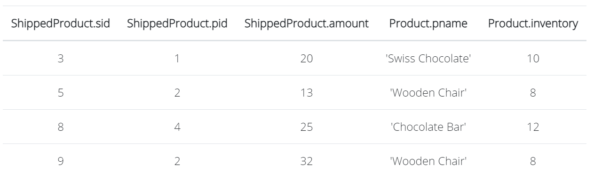
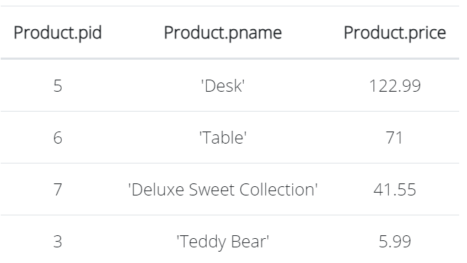

# COSC 304 - Introduction to Database Systems Lab 1: Querying using Relational Algebra

## [RelaX - Online Relational Algebra Tool](https://dbis-uibk.github.io/relax/)

[RelaX](https://dbis-uibk.github.io/relax/) is an online relational algebra tool that we will use for the assignments. It allows entering relational algebra expressions and executing them to get results. The data set can be loaded from a GitHub Gist including the [Bookstore data set GIST: 367f41bb51110ef3c84bb5f906f2fb87](https://gist.github.com/rlawrenc/367f41bb51110ef3c84bb5f906f2fb87) used for sample relational algebra queries in this lab, and the [Shipment database GIST: 585ee1836abb142a461d137e12dd14a3](https://gist.github.com/rlawrenc/585ee1836abb142a461d137e12dd14a3) used in the lab questions.
 

## Relational Algebra Questions (10 marks - 2 marks each)

Given the following relational schema, write queries in **relational algebra** to answer the English questions using the <a href="http://dbis-uibk.github.io/relax/">online relational algebra tool</a>. The database definition is available as a [Shipment database GIST: 585ee1836abb142a461d137e12dd14a3](https://gist.github.com/rlawrenc/585ee1836abb142a461d137e12dd14a3). The database is also available as an <a href="Shipment.sql">DDL file.</a>

<pre>
Customer(<i>cid:</i> integer, <i>cname:</i> string, <i>address:</i> string, <i>city:</i> string, <i>state:</i> string)
Product(<i>pid:</i> integer, <i>pname:</i> string, <i>price:</i> currency, <i>inventory:</i> integer)
Shipment(<i>sid:</i> integer, <i>cid:</i> integer, <i>shipdate:</i> Date/Time)
ShippedProduct(<i>sid:</i> integer, <i>pid:</i> integer, <i>amount:</i> integer)
</pre>

<ol>
<li> Return the product name, price, and inventory for all products with an inventory more than 10.  Expected output: </li>

<li> Return the shipment id, date, and customer id of all shipments that contain product id 3 with amount less than 10.  Expected output: </li>

<li> Return a list of all the customer id and names that have received a shipment after March 1, 2015 and contain some product with id less than 4 that had an amount more than 5.  Expected output: </li>

<li> Return the product name, current inventory, shipment amount, and customer state where the product had a shipment of an amount at least half of its current inventory and the customer state was either NJ or IA. Expected output: </li>

<li> Return a list of product ids and names where the product has either a price < $40.00 or has appeared in a shipment for a customer with id greater than 3. Expected output:  Note: Order does not matter for records.</li>
</ol>

