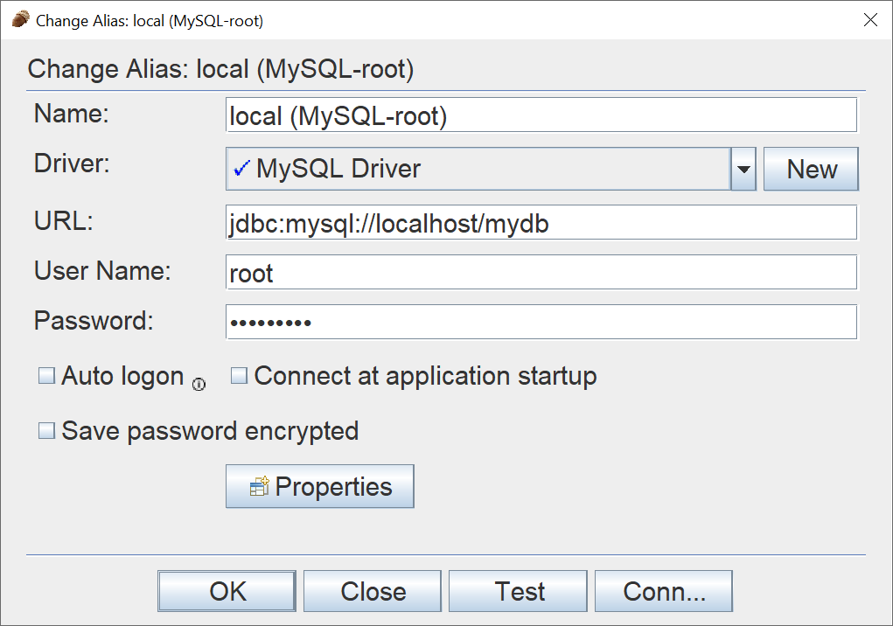

# COSC 304 - Introduction to Database Systems<br>Lab 2: SQL DDL and DML - Local Setup

**Before starting:** Install Docker Desktop by following the [course setup instructions](../../setup).

### 1. Get the course files

You need a local copy of the COSC 304 GitHub repository. Either:

* Clone the repository:

  ```text
  git clone https://github.com/rlawrenc/cosc_304.git
  ```
* Or use **Code → Download ZIP** on GitHub and unzip the downloaded file.
Open a terminal and change to the Lab 2 setup directory:

```text
cd cosc_304/labs/lab2/setup
```

If you downloaded the ZIP, the directory may instead be named `cosc_304-main`.

### 2. Start MySQL

Make sure Docker Desktop is running, then from the `labs/lab2/setup` directory run:

```text
docker compose up -d
```

The first time this command is run, Docker downloads MySQL and initializes the database. This may take a minute.

Check that the container is running:

```text
docker compose ps
```

MySQL is available on `localhost` port `3306`.

If port `3306` is already being used on your computer, change this line in `docker-compose.yml`:

```text
- '3306:3306'
```

to:

```text
- '3307:3306'
```
You would then connect to MySQL using port `3307`.

### 3. Connect to MySQL

Connect directly to the MySQL command-line interface:

```text
docker compose exec cosc304-mysql mysql -u root -p
```

Enter the root password from `docker-compose.yml`.

Useful MySQL commands include:

| Function          | Command           |
| ----------------- | ----------------- |
| List databases    | `SHOW DATABASES;` |
| Select a database | `USE university;` |
| List tables       | `SHOW TABLES;`    |
| Exit MySQL        | `exit`            |

The `university`, `workson`, and `shipment` databases should already be created and populated when the container is first initialized.

Note that you may also start MySQL from a bash shell on the container using:

```
docker exec -it cosc304-mysql bash
```

This will start a command line session. Connect to MySQL using:

```
mysql -u root -p
```
OR
```
mysql -u testuser -p
```


## 4. Stop MySQL

When finished, stop the container with:

```text
docker compose down
```

Your database contents are preserved and will be available the next time you run:

```text
docker compose up -d
```

### Resetting the Database

If you need to completely reset the database and rerun the initialization scripts:

```text
docker compose down -v
docker compose up -d
```

**Warning:** `docker compose down -v` deletes the MySQL database volume and all changes you have made to it.

The university database should already be loaded. If you have any issues, you can create the tables and load the data for the [university database using this DDL script](../ddl/university_MySQL_DDL.sql).  

## Optional: SQuirreL SQL

You may also connect using [SQuirreL](http://squirrel-sql.sourceforge.net) or another MySQL-compatible database client.

[Download and install MySQL JDBC driver](mysql-connector-java-8.0.27.jar) and put it in the SQuirreL `lib` folder.

Connection information:

```text
Host: localhost
Port: 3306
User: root
Password: see docker-compose.yml
Database: university
```

If you changed the Docker port to `3307`, use port `3307` here instead.


