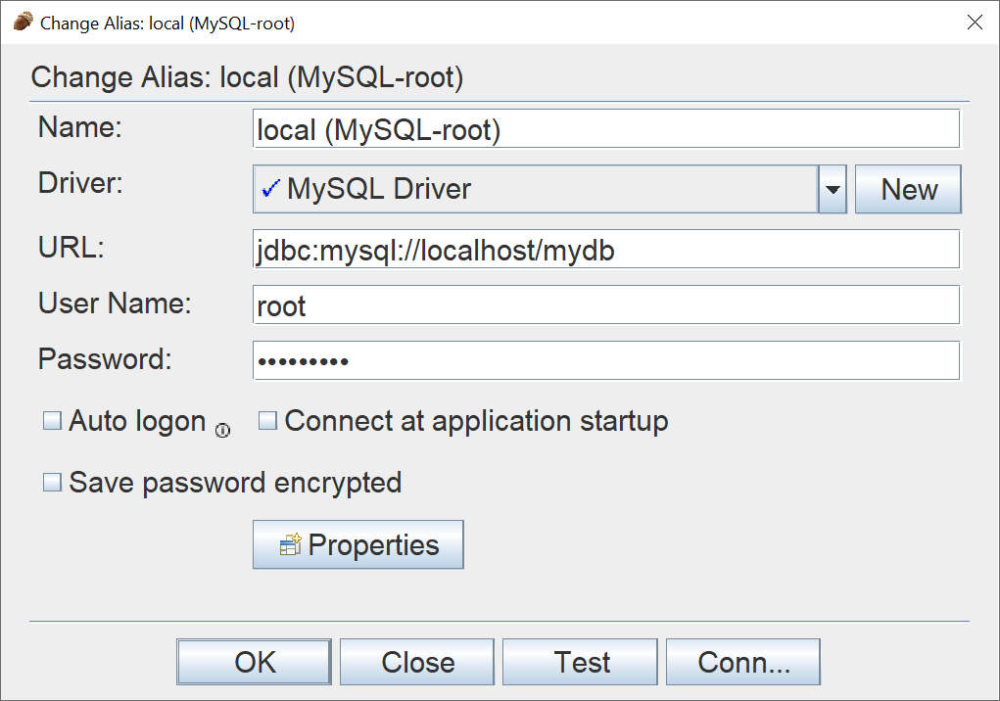

# COSC 304 - Introduction to Database Systems<br>Lab 3: Writing SQL Queries on a MySQL Database

This lab practices writing SQL queries on a MySQL database.

**Make sure your computer is setup to run Docker by following these [setup instructions](../setup).**

### Step #1: Setup MySQL Docker Container

 - Create a directory `cosc304_lab3`.
 - Download the `docker-compose.yml` file into the `cosc304_lab3` directory. 
 - Create a folder `ddl` in `cosc304_lab3` directory. Download the contents of the `ddl` folder into the `cosc304_lab3\ddl` folder.
 - Open a command shell either directly on your machine or using VSCode. Make sure your current directory is `cosc304_lab3`.
 - Run the command `docker-compose up -d`
 - If everything is successful, the MySQL database will start on port 3306. If there is a port conflict, change the port to 3307 in the `docker-compose.yml` file.
 - Your database is `mydb`. There are other databases also created such as `workson` and `university`.

## Step #2: Access MySQL using Command Interface

MySQL commands can be running using the command line within the Docker container. Run the command:

```
docker exec -it cosc304-mysql bash
```

This will start a command line session. Connect to MySQL using:

```
mysql -u root -p
```
OR
```
mysql -u testuser -p
```

The password is given in the `docker-compose.yml` file (which you are **encouraged to change**). Note that all commands are terminated with a semi-colon (`;`). Some useful commands are:

| Function  | Command |
| ------------- | ------------- |
| Listing all databases	  | `show databases;`  |
| Use database `dbname`  | `use dbname;`  |
| List all tables  | `show tables;`  |

**Note that if any of the DDL scripts fail to run to setup your database. Then either run them using SQuirreL SQL or login to mysql command prompt and use `source` command such as: `source /docker-entrypoint-initdb.d/ShipmentMySQL.sql`.**


### Step #2: Accessing MySQL using SQuirreL SQL

[SQuirreL](http://squirrel-sql.sourceforge.net) is an open source graphical query tool capable of querying any JDBC-accessible database including Oracle, MySQL, and SQL Server.

Start up SQuirreL.  Register our MySQL server with the information: 

<pre>
Name: MySQL
Login name: root
Password: (see docker-compose.yml file)
Host name: localhost
Port: (leave blank for default)
Database: mydb
</pre>



### Step #3: Practice SQL DDL

The university database should already be loaded. If you have any issues, using SQuirreL, create the tables and load the data for the [university database using this DDL script](ddl/university_MySQL_DDL.sql).  

### The Database Schema

Here is the database schema that we will be using for our practice SQL queries:

<pre>
student (<u>snum</u>, sname, major, standing, age)
faculty (<u>fid</u>, fname, deptid)
course (<u>cname</u>, meets_at, room, fid);
enrolled (<u>snum</u>, <u>cname</u>)
</pre>


### SQL Questions

Here are the questions that you must answer using SQL. **You can answer them in groups.  Try to answer one challenge question and write your own for others and the next class!**

<ol>
<li>Return all students (name only) with 'SO' or 'JR' standing and a 'Computer Science' major.</li>
<li>Return all courses (name and room only) taught by 'Richard Jackson'</li>
<li>Return all students (number and name only) that are enrolled in a course offered in room 'R15' taught by a faculty member in department '68' and have 'SR' standing.</li>
<li>Return all courses that have 'Data' in their title.  Sort them by course name.</li>
<li>For each department, return its id and the number of courses offered by faculty associated with that department.  Sort the list in descending order of number of courses offered.  Rename this count field as 'CoursesOffered'.</li>
<li>For each student, return their number, name, and number of courses they are enrolled in.  Students must appear in the list even if they are not registered for any courses.  Sort in descending order of the number of courses enrolled in.</li>
<li>Return a list of courses (name only and number of students enrolled) that are either offered by faculty in deptId = '11' OR by 'Ivana Teach' and have at least 2 students enrolled in them.</li>
<li>Return the students who are above the average student age.</li>
<li>Return all students that are not taking any courses.</li>
<li>Return all 'Computer Science' majors who are younger than all 'Psychology' majors.</li>
</ol>


#### Answers

<ol>
<li><pre>SELECT sname
FROM student
WHERE (standing = 'JR' OR standing = 'SO') AND major = 'Computer Science';</pre></li>

<li><pre>SELECT *
FROM faculty F, course C
WHERE F.fid = C.fid and F.fname = 'Richard Jackson';</pre></li>

<li><pre>SELECT S.snum, sname
FROM student S, course C, faculty F, enrolled E
WHERE S.snum = E.snum AND C.cname = E.cname AND C.fid = F.fid AND C.room = 'R15' 
      AND F.deptId = '68' AND S.standing = 'SR';</pre></li>

<li><pre>SELECT *
FROM course
WHERE cname LIKE '%Data%'
ORDER BY cname;</pre></li>

<li><pre>SELECT deptId, COUNT(cname) AS CoursesOffered
FROM faculty F, course C
WHERE F.fid = C.fid
GROUP by deptId
ORDER BY CoursesOffered DESC;</pre></li>

<li><pre>SELECT S.snum, sname, COUNT(cname)
FROM student S LEFT OUTER JOIN enrolled E ON S.snum = E.snum
GROUP BY S.snum, sname
ORDER BY COUNT(cname) DESC;</pre></li>

<li><pre>SELECT C.cname, COUNT(*)
FROM course C, enrolled E, faculty F
WHERE C.cname = E.cname AND C.fid = F.fid AND (F.deptId = '11' OR F.fname = 'Ivana Teach')
GROUP BY C.cname
HAVING COUNT(*) >= 2;</pre></li>

<li><pre>SELECT *
FROM student
WHERE age > (SELECT AVG(age) FROM student);
</pre></li>

<li><pre>SELECT *
FROM student
WHERE snum NOT IN (SELECT snum FROM enrolled);</pre></li>

<li><pre>SELECT *
FROM student
WHERE major = 'Computer Science' 
      AND age < ALL (SELECT age FROM student WHERE major = 'Psychology');</pre></li>
</ol>


#### Challenge questions:

<ol>
<li>Return the maximum, minimum, and average number of courses students are enrolled in.  For example, if one student is enrolled in 10 courses, that is the maximum.  The minimum is 1 (not including 0 registrations).  Take the average based on students who are enrolled in at least one course.</li>
<li>Return all faculty members (fid, fname, and number of courses taught) who teach more courses than all other faculty.  If more than 1 faculty member teaches the maximum, then show all that teach the maximum number of courses.</li>
</ol>

#### Answers:

<ol>
<li><pre>SELECT MAX(NumCourses), MIN(NumCourses), AVG(NumCourses)
FROM (SELECT S.snum, sname, COUNT(*) as NumCourses
       FROM student S JOIN enrolled E ON S.snum = E.snum
       GROUP BY S.snum, sname) AS T;</pre></li>

<li><pre>SELECT F.fid, F.fname, COUNT(*)
FROM faculty F, course C
WHERE C.fid = F.fid
GROUP BY F.fid, F.fname
HAVING COUNT(*) >= ALL(SELECT COUNT(*) FROM course GROUP BY fid);</pre></li>
</ol>

## [Lab 3 - SQL Lab Assignment](assign/)
