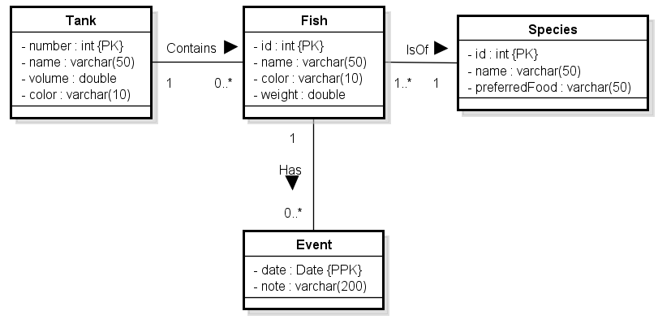

# COSC 304 - Introduction to Database Systems Lab 5: Converting ER/UML diagrams into the Relational Model

## Example #1

Convert the fish store ER diagram into the relational model:

### Answer:

<pre>
Fish (<u>id</u>, name, color, weight, <i>tankNumber</i>, <i>speciesId</i>)  // tankNumber is a FK to Tank, speciesId is a FK to Species
Species (<u>id</u>, name, preferredFood)
Tank (<u>number</u>, name, volume, color)
Event (<i><u>fishId</u></i>, <u>eventDate</u>, note) // fishId is a FK to Fish
</pre>

## Example #2

Convert the ER diagram for hotel reservation system into the relational model:

### Answer:

<pre>
Hotel (<u>name</u>, streetNumber, streetName, city, state, postalCode, webAddress, phoneNumber)
Floor (<i><u>hotelName</u></i>, <u>number</u>) // hotelName is a FK to Hotel
Room (<i><u>hotelName</u></i>, <i>floorNumber</i>, <u>identifier</u>, numBeds, isSmokingRoom) 
   // (hotelName, floorNumber) is a FK to Floor ; hotelName is a FK to Hotel
Customer (<u>id</u>, firstName, middleName, lastName, address, city, state, country, postalCode, homePhoneNumber, workPhoneNumber, cellPhoneNumber, emailAddress)
Reservation (<i><u>hotelName</u></i>, <i><u>customerId</u></i>, <u>arrivalDate</u>, departDate, smokingRoom, numBeds, highOrLowFloor, creditCardType, creditCardNum, creditCardExpiry, <i>roomIdentifier</i>)
   // hotelName is a FK to Hotel ; customerId is a FK to Customer ; (hotelName, roomIdentifier) is a FK to Room
Invoice (<u>id</u>, <i>hotelName</i>, <i>customerId</i>, <i>arrivalDate</i>, openDate, closeDate, totalBalance) 
   // (hotelName,customerId,arrivalDate) is FK to Reservation
InvoiceCharge (<i><u>invoiceId</u></i>, <u>transactionId</u>, chargeType, description, amount) // InvoiceId is a FK to Invoice
</pre>

## [Lab 5 Assignment](assign/)
