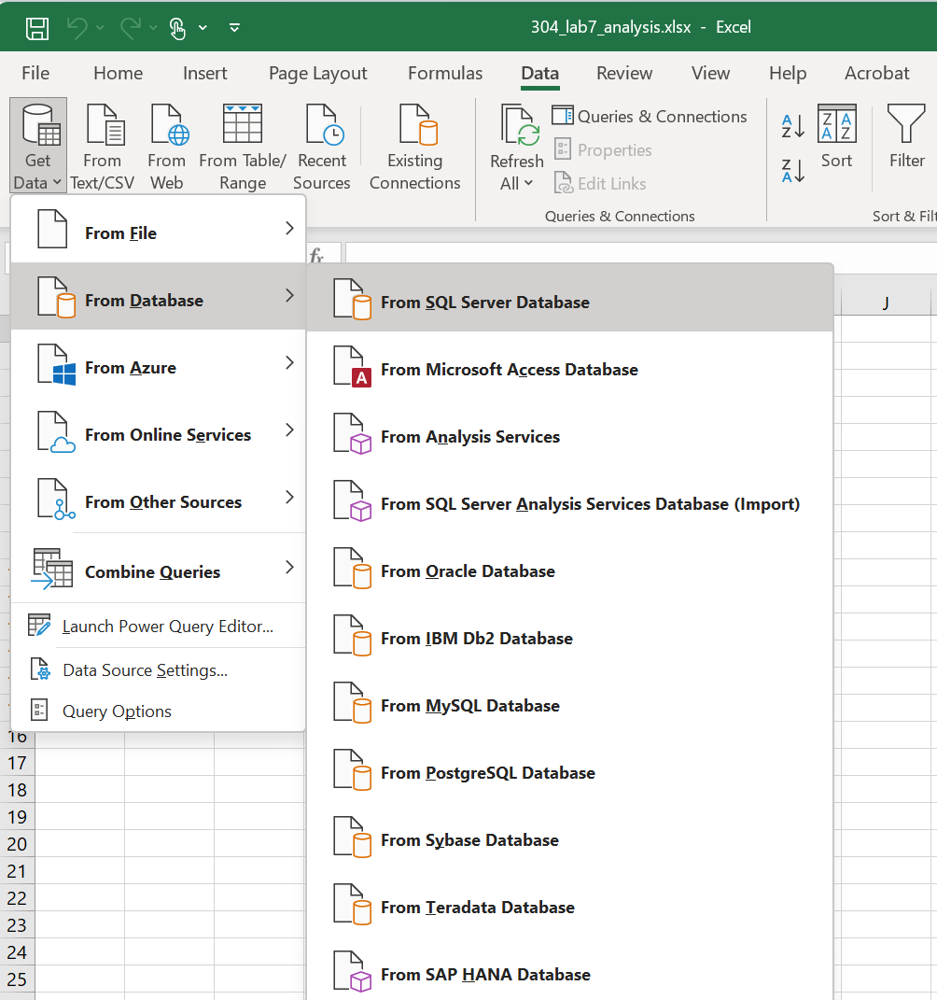
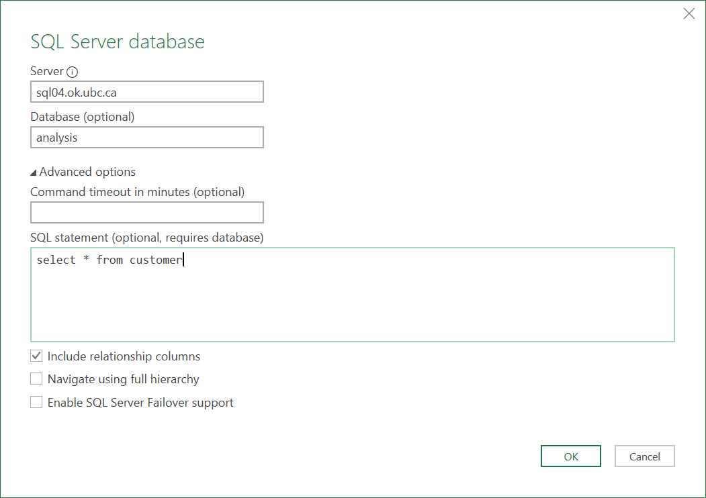
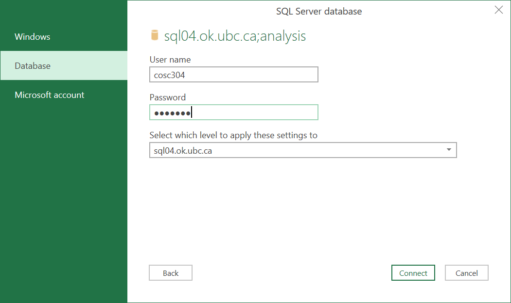
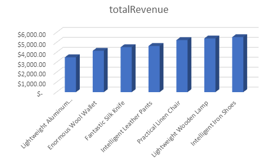
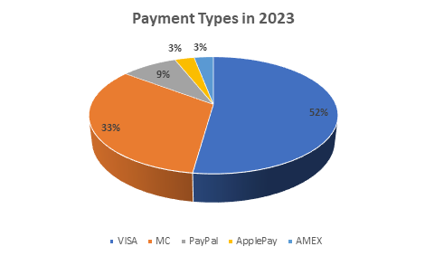
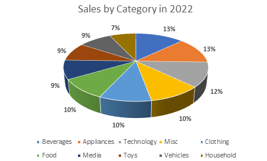
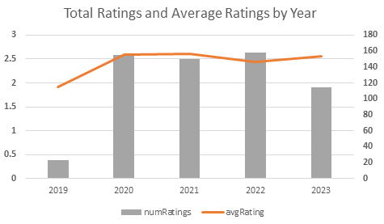

# COSC 304 - Introduction to Database Systems Lab 7 - Using Databases with Analysis Software (Excel)

You have just been hired as the first data analyst at the ACME company. ACME has been selling products for many years and recording that information in a database. However, they have not been using that collected data to improve their business by tracking key customers and item sales volume, and modifying their pricing and distribution strategies. Your role is to provide these insights to management in a way that is easily understood.

## ACME Company Details

The ACME company sells all kinds of products. Every product has a given category, and customers are encouraged to review products.  Customers place orders through a website. Orders are shipped from one of three warehouses in Kelowna, Winnipeg, and Toronto. Each warehouse maintains inventory on its products. The company needs information on its top selling products, largest customers, and efficiency of its distribution system.

The ACME database is stored on Microsoft SQL Server. It is read-only and accessible at `cosc304.ok.ubc.ca` with database `analysis`. If using SQuirreL, the JDBC URL is: `jdbc:sqlserver://cosc304.ok.ubc.ca;databaseName=analysis;trustServerCertificate=true`.  User id and password are on Canvas. To access the database, you must be on campus connected to ubcsecure WiFi or connect to campus via VPN (`myvpn.ok.ubc.ca`).

## Part 1: Descriptive Analysis (20 marks)

The first step is to gather descriptive statistics from the company data. This will be done using SQL queries. The output of this analysis is a document containing each question, the SQL query, and the output table.

1. List the 10 lowest priced items (id, name, price). (1 mark)

| productId | productName               | productPrice |
| --------- | ------------------------- | ------------ |
| 92        | Fantastic Wooden Keyboard | 0.49         |
| 154       | Heavy Duty Marble Table   | 0.61         |
| 85        | Small Steel Shoes         | 4.39         |
| 71        | Synergistic Marble Plate  | 8.08         |
| 56        | Sleek Copper Knife        | 8.51         |
| 150       | Incredible Wool Plate     | 12.78        |
| 96        | Enormous Copper Car       | 13.42        |
| 164       | Mediocre Plastic Pants    | 15.54        |
| 64        | Gorgeous Linen Shirt      | 18.44        |
| 155       | Gorgeous Concrete Pants   | 22.21        |

2. Show the id, name, city, and state for the top 5 customers based on order total amount. (2 marks)

| customerId | firstName | lastName | city                | state | totalOrderAmount |
| ---------- | --------- | -------- | ------------------- | ----- | ---------------- |
| 46         | Leisa     | Will     | Ziemannton          | NF    | 52067.75         |
| 98         | Amal      | Schiller | Christiansenborough | NB    | 50172.41         |
| 76         | Mathilda  | Rowe     | Aracelyborough      | QC    | 49468.52         |
| 94         | Ariel     | Tromp    | New Geoffreychester | SK    | 48761.63         |
| 55         | Theresia  | Harvey   | South Glennis       | SK    | 47793.56         |

3. List the top 10 ordered products by total quantity (id, name, total quantity) in 2023. (2 marks)

| productId | productName                 | totalQuantity |
| --------- | --------------------------- | ------------- |
| 154       | Heavy Duty Marble Table     | 81            |
| 125       | Small Silk Keyboard         | 72            |
| 133       | Lightweight Plastic Watch   | 70            |
| 184       | Fantastic Concrete Bottle   | 68            |
| 199       | Sleek Cotton Lamp           | 68            |
| 21        | Awesome Paper Shoes         | 67            |
| 165       | Mediocre Aluminum Plate     | 67            |
| 169       | Fantastic Wooden Coat       | 66            |
| 150       | Incredible Wool Plate       | 65            |
| 86        | Synergistic Bronze Computer | 64            |

4. List the bottom 7 ordered products (id, name, total revenue) that have generated the least amount of revenue. Only show products that have had a total quantity ordered of at least 60. (3 marks)

| productId | productName                 | totalRevenue |
| --------- | --------------------------- | ------------ |
| 48        | Lightweight Aluminum Gloves | 3502.07      |
| 162       | Enormous Wool Wallet        | 4156.69      |
| 40        | Fantastic Silk Knife        | 4515.65      |
| 100       | Intelligent Leather Pants   | 4637.83      |
| 45        | Practical Linen Chair       | 5228.64      |
| 7         | Lightweight Wooden Lamp     | 5395.01      |
| 4         | Intelligent Iron Shoes      | 5527.69      |

5. List the customer (id, names, average rating) who gives the highest average review rating considering all of their reviews. (3 marks)

| customerId | firstName | lastName | avgRating |
| ---------- | --------- | -------- | --------- |
| 32         | Brandee   | West     | 5         |

6. Show the payment types based on total order amount by year. Only show years 2020 to current. An order must be shipped to be counted for a payment. Order by year ascending and total payment amount descending. Note: This query is hard since `ordersummary` does not have a payment id for each order. We will assume that if a customer has multiple payment methods, then the method with the smallest `paymentMethodId` was the one used for all their orders. (3 marks)

|      | paymentType | totalPaymentAmount |
| ---- | ----------- | ------------------ |
| 2020 | VISA        | 307440.61          |
| 2020 | MC          | 206010.13          |
| 2020 | PayPal      | 37408.81           |
| 2020 | AMEX        | 31748.90           |
| 2020 | ApplePay    | 16474.36           |
| 2021 | VISA        | 339138.66          |
| 2021 | MC          | 213836.72          |
| 2021 | PayPal      | 78742.10           |
| 2021 | AMEX        | 36261.00           |
| 2021 | ApplePay    | 16706.42           |
| 2022 | VISA        | 315487.59          |
| 2022 | MC          | 211686.66          |
| 2022 | PayPal      | 51534.70           |
| 2022 | ApplePay    | 41460.50           |
| 2022 | AMEX        | 35080.32           |
| 2023 | VISA        | 270514.28          |
| 2023 | MC          | 171443.02          |
| 2023 | PayPal      | 45045.61           |
| 2023 | ApplePay    | 15659.39           |
| 2023 | AMEX        | 15458.50           |

7. Show the top 5 products (id, name, total quantity difference) that are shipped more frequently from the Kelowna warehouse compared to the Toronto warehouse. Hint: Subqueries may be useful. (3 marks)

| productId | productName                | quantityDiff |
| --------- | -------------------------- | ------------ |
| 116       | Mediocre Steel Hat         | 89           |
| 27        | Mediocre Wooden Bag        | 77           |
| 152       | Ergonomic Granite Watch    | 76           |
| 199       | Sleek Cotton Lamp          | 66           |
| 131       | Lightweight Concrete Chair | 65           |

8. Show the top 10 products that have the highest current inventory based on its sales for 2022. Calculate this as a ratio. For example, if the inventory of product X is currently 100, and the sales volume for product X in 2022 is 10, then the inventory ratio is 100/10 = 10. If a product has no sales in 2022, it should be in the list with a sales ratio of 9999. You may want to use the [SQLServer ISNULL() function](https://learn.microsoft.com/en-us/sql/t-sql/functions/isnull-transact-sql?view=sql-server-ver16). (3 marks)

| productId | totalInventory | totalSold | inventoryRatio |
| --------- | -------------- | --------- | -------------- |
| 16        | 1213           | <null>    | 9999           |
| 44        | 1057           | <null>    | 9999           |
| 48        | 1536           | <null>    | 9999           |
| 54        | 897            | <null>    | 9999           |
| 121       | 1600           | <null>    | 9999           |
| 141       | 889            | <null>    | 9999           |
| 157       | 1070           | 1         | 1070           |
| 46        | 1006           | 1         | 1006           |
| 83        | 1983           | 3         | 661            |
| 59        | 1204           | 2         | 602            |

## Part 2: Data Visualization (20 marks)

Analyzing data is easier using visualizations. The next step is to visualize data using Excel.

### Connecting Excel and SQL Server

To read data into Excel from SQL Server, follow these steps:

1) Open Excel. Under the `Data` Menu, select `Get Data` then, `From Database`, then `From SQL Server Database`.

2) Enter `cosc304.ok.ubc.ca` for the server and `analysis` for the database. Select `Advanced options` and enter the SQL query that you want to perform. Click `OK`.

3) For authentication, select `Database` authentication. The user id is `cosc304`.

4) Click the `Load` button to load the data into a worksheet.

### Visualizations

Create the following visualizations with one worksheet per visualization. Use the name of the worksheet given. List the SQL query performed under the chart. **Chart images do NOT have to look exactly like the samples provided.**

1. Sheet: `worstproducts` Visualize query 4 from part 1 showing the bottom 7 ordered products using a 3D column chart. (5 marks)

2. Sheet: `paymentmethods` Use a pie chart to show the percentage payment volume (based on order total amount) by payment method in 2023. (Similar to Q6 in Part 1.) (5 marks)

3. Sheet: `categoryvolume` Use a pie chart to show the percentage products ordered by category (based on order total amount) in 2022. (5 marks)

4. Sheet: `reviews` Use a combo chart to show the number of reviews performed per year (columns) and the average review rating in that year (as a line). (5 marks)

## Part 3: Bonus (up to 10 marks)

Create two more queries and visualizations in Excel for bonus marks (+5 bonus marks each). The query and visualization should have complexity similar to the previous questions. The TAs will decide if the query has sufficient complexity. Try to create visualizations that are unique, interesting and would be valuable to the company.

# Submission

Submit your document for Part 1 and your Excel file for Part 2 on Canvas. Bonus marks are available for early review by the TA in a virtual office hours.
