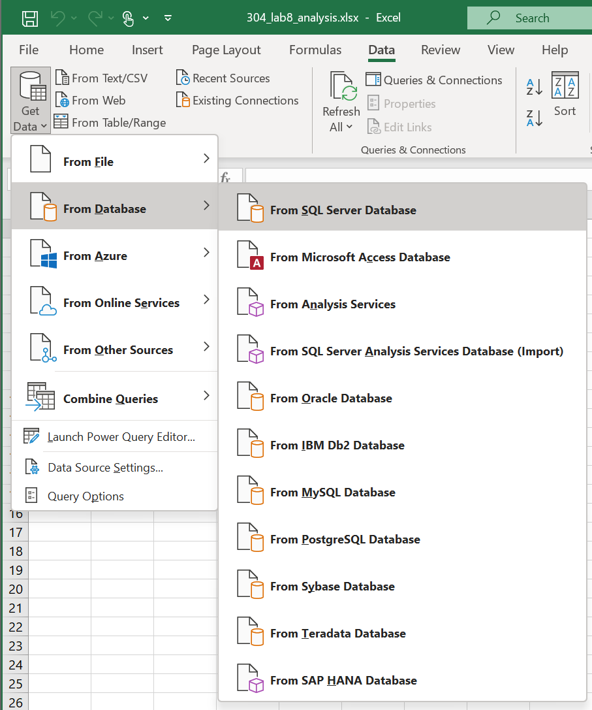
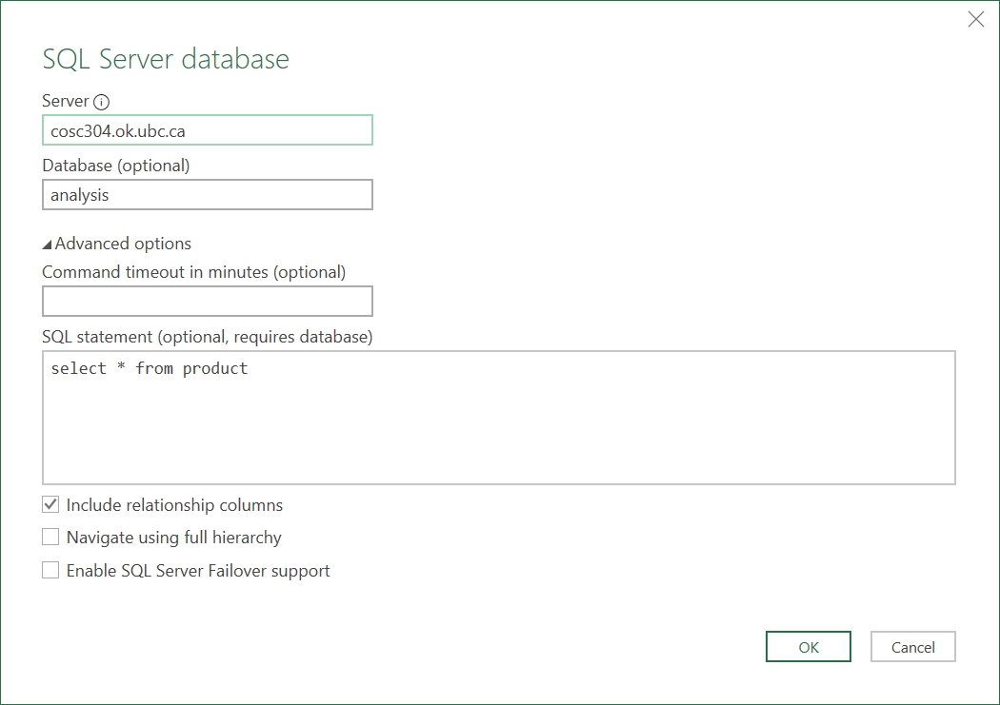
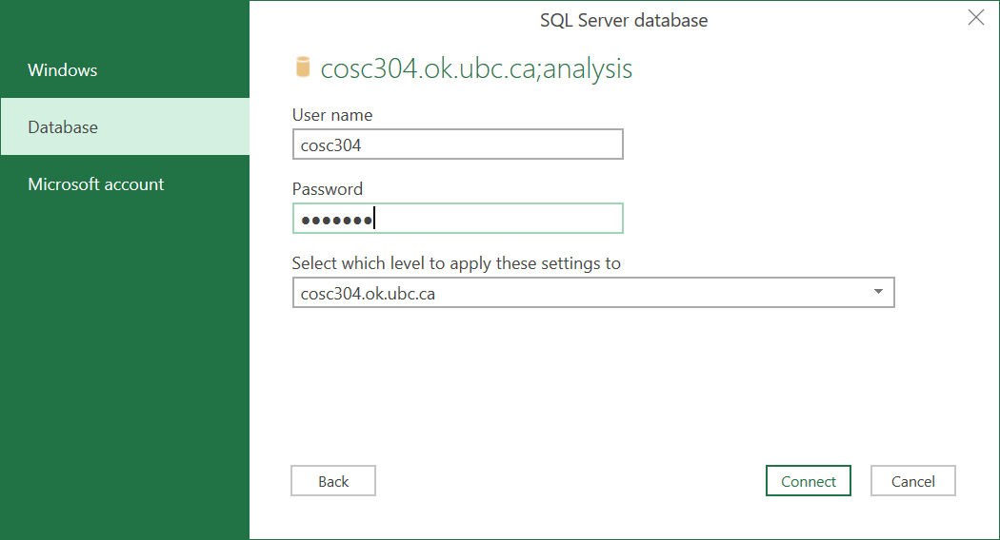
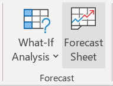
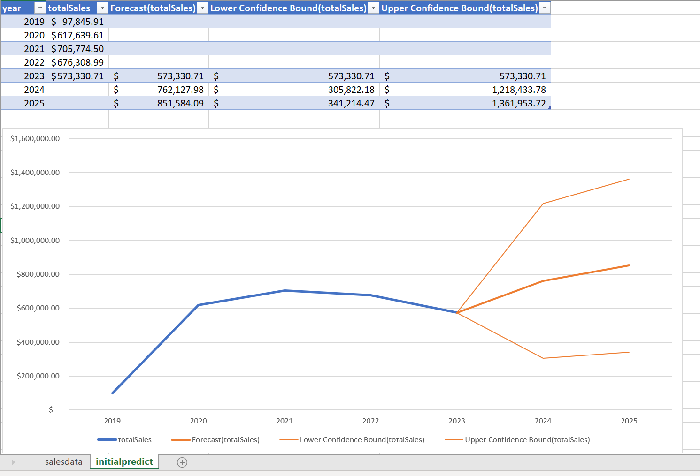
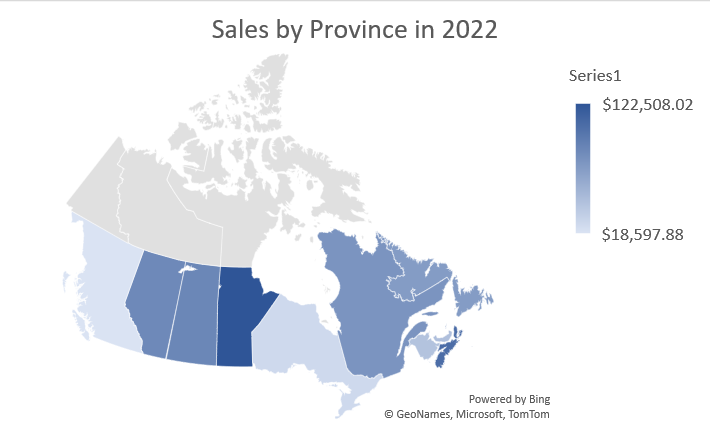

# COSC 304 - Introduction to Database Systems<br>Lab 8 - Data Prediction, Forecasting, and Visualization

## ACME Company Goals

Your managers found the data analysis you performed previously very helpful in understanding their customers, products, and overall business. They have now started asking questions about not just the current state of the business but also future trends for use in long range planning. ACME Company has tasked you with several goals related to prediction and forecasting, specifically predicting their overall sales for the next few years and best selling products. The output of this analysis will be an Excel file called `304_lab8_analysis.xlsx`. 

### Connecting Excel and SQL Server

To read data into Excel from SQL Server, follow these steps:

1) Open Excel. Under the `Data` Menu, select `Get Data` then, `From Database`, then `From SQL Server Database`.



2) Enter `cosc304.ok.ubc.ca` for the server and `analysis` for the database. Select `Advanced options` and enter the SQL query that you want to perform. Click `OK`.



3) For authentication, select `Database` authentication. The user id and password is provided on Canvas. Note that you must be connected to UBC VPN in order to access the database. 



4) Click the `Load` button to load the data into a worksheet.

## Part 1: Prediction and Forecasting (25 marks)

Performing predictions is easy in Excel, and there are several methods to do it.

### Question 1: Predicting Company Sales (10 marks)

Let's go through the steps to predict the company sales for the next two years (2024, 2025). The initial query to retrieve the data is: 

```
SELECT YEAR(orderDate) as year, SUM(TotalAmount) as totalSales
FROM ordersummary
GROUP BY YEAR(orderDate)
ORDER BY YEAR(orderDate)
```
Connect to the database using Excel. Execute the query and load the data into Excel. Store data in sheet called `salesdata`. 

There are several ways to perform a prediction. Excel has a [**forecast** function](https://support.microsoft.com/en-us/office/forecast-and-forecast-linear-functions-50ca49c9-7b40-4892-94e4-7ad38bbeda99) that will predict an output value based on an input value and the prior data series points.


Another way is to create a graph and add a [linear trend line](https://support.microsoft.com/en-us/office/add-a-trend-or-moving-average-line-to-a-chart-fa59f86c-5852-4b68-a6d4-901a745842ad).


It is also possible to use **Forecast Sheet**. Once you have a data set loaded and selected, on the **Data** tab, in the **Forecast** group, click **Forecast** Sheet. An [example walkthrough written by Microsoft](https://support.microsoft.com/en-us/office/create-a-forecast-in-excel-for-windows-22c500da-6da7-45e5-bfdc-60a7062329fd) is available.



Create a forecast sheet and rename it as `initialpredict` similar to shown below.



The results of these forecast methods produce different results. Completing this part is worth 5 marks.

| Year   | Linear Regression   | Linear Treandline  | Forecase Sheet  |
|---|---|---|---|
| 2024 | $837,071.64  | $837,072.00  | $762,127.98 | 
| 2025 | $938,035.54  | $938,036.00  | $851,584.09 |


Unfortunately, this prediction is not very accurate for several reasons. First, 2019 was only a partial year for sales starting in October. Similarly, the 2023 selling season is not complete with data only up to October. The *art* of making predictions comes from deciding what to do with incomplete, missing, or inaccurate data. Perform an updated prediction and save in the sheet `salesprediction`. Here are the assumptions:

1. 2019 data will not be used as it is incomplete.
2. 2023 data will be increased by 20% as there are still 2 months of sales. (Note: This estimate could be better as many retailers do a higher percentage of sales around Christmas.)
3. Generate an updated sales table and sales prediction for 2024 and 2025.

This second prediction is worth 5 marks.


### Question 2: Predicting Sales by Region (5 marks)

ACME Company wants to understand its sales by province (state). Generate a query that produces data with the overall sales by province for the years 2020 to 2022. Use this data to predict the province with the highest sales in 2023 and 2024.

Excel has a nice [map chart visualization](https://support.microsoft.com/en-us/office/create-a-map-chart-in-excel-f2cfed55-d622-42cd-8ec9-ec8a358b593b) for displaying data on a map. Create a map chart showing the total sales by province for 2022 similar to below.



### Question 3: Predicting Top Product Sales (10 marks)

The goal is to predict the top 3 selling products in 2024 based on historical data from 2020 to 2023. The data table and visualization should be in a sheet called `productsales`. This is an open-ended question, and there are multiple ways to approach this. A challenge is that there are 200 products to consider. Although you may use Python or Java to perform code analysis, that is not required. The question is marked based on your approach and discussion more than your final result. Note: Use of Generative AI (including Copilot and ChatGPT) is allowed for this part. Document any sources used to build your analysis.

Marking:
1. Write a short paragraph describing your analysis approach. (2 marks)
2. Implement your analysis approach in Excel, SQL, and maybe Java/Python code. (5 marks)
3. List any sources (website, AI conversations) used to design and implement your approach. (2 marks)
4. List your predicted top 3 selling products for 2024 and their predicted sales volume (quantity*price). (1 mark)

# Submission

Submit your Excel file on Canvas. Bonus marks are available for early review by the TA in a virtual office hours.
