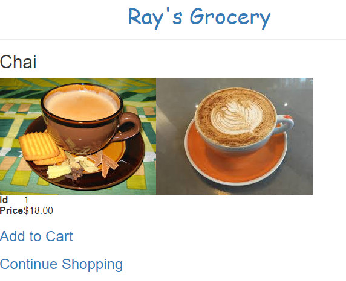
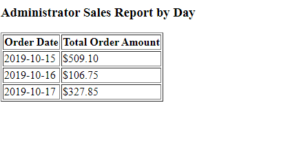
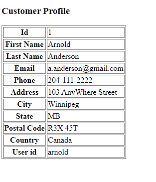
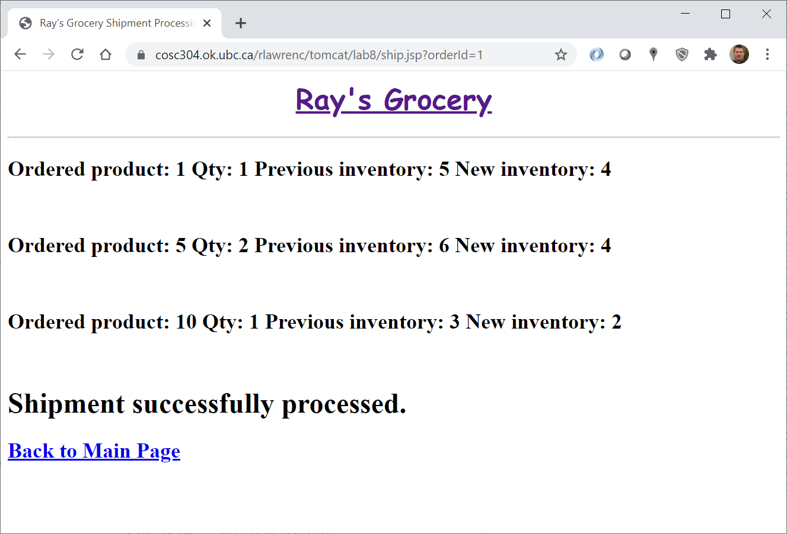
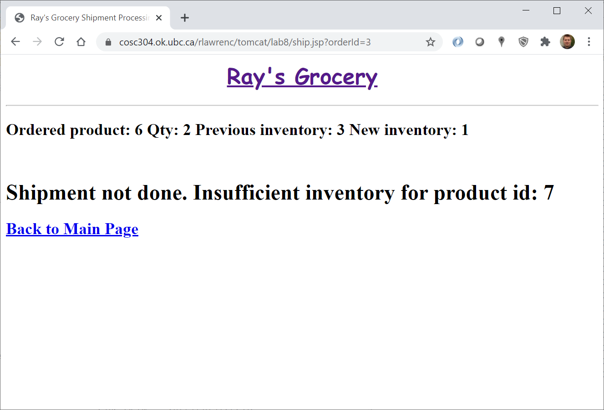

# COSC 304 - Introduction to Database Systems Lab 8: Images, Security, and Transactions

Modify your existing project web site from lab 7 with new features including a product detail page, a login feature, an administrator page, and support for transactions.

## Project Requirements (25 marks)

1. [Sample web site (is down now)](http://cosc304.ok.ubc.ca/rlawrenc/tomcat/lab8/index.jsp)

2. Start with the setup for lab 7 for either [Java](https://github.com/rlawrenc/cosc_304/blob/master/labs/lab7/java/assign/setup), [PHP](https://github.com/rlawrenc/cosc_304/blob/master/labs/lab7/php/assign/setup), or [Node.js](https://github.com/rlawrenc/cosc_304/blob/master/labs/lab7/nodejs/assign/setup). **If you have an existing Docker container for lab 7, you do not need to download and setup lab 7 again.**

3. Download starter code for [Java](304_lab8_java.zip), [PHP](304_lab8_php.zip), or [Node.js](304_lab8_node_starter.zip). These code files should be **ADDED** to your existing lab 7 project. Note that `orderdb_sql.ddl` has been modified to include new SQL statements at the end. There is a new main page (`index.jsp/php`), an administrator page (`admin.jsp/php`), and images in the `img` folder. The four new code files to change: `validateLogin.jsp/php`, `product.jsp/php`, `admin.jsp/php`, and `ship.jsp/php`.

4. Your output does not have to look exactly like the sample (feel free to make it look better!).

The product page will show details on the product including images. An image can be retrieved from a local folder using a URL or stored as a binary object in the database.

#### Marking Guide (product page): (5 marks)

- **+1 mark1** - for modifying product listing page to go to product detail page when click on product name
- **+1 mark1** - for using PreparedStatement to retrieve and display product information by id
- **+1 mark1** - for displaying an image using an HTML `img` tag based on `productImageURL` field
- **+1 mark1** - for displaying an image from the binary field `productImage` by providing an `img` tag and modifying the `displayImage.jsp/php` file.
- **+1 mark** - for adding link to "add to cart" and to "continue shopping"

#### Screenshot

#### Marking Guide (admin and login page): (5 marks)

- **+1 mark** - for checking user is logged in before accessing page
- **+2 mark** - for displaying a report that list the total sales for each day. Hint: May need to use date functions like `year`, `month`, `day`.
- **+1 mark** - for displaying current user on main page (`index.jsp/php`)
- **+1 mark** - for modifying `validateLogin` to check correct user id and password

#### Screenshot

#### Marking Guide (customer page): (5 marks)

- **+2 marks** - for displaying error message if attempt to access page and not logged in
- **+3 marks** - for retrieving customer information by id and displaying it

#### Screenshot

#### Marking Guide (shipment page): (5 marks)

Use transactions to take an order id and either process a shipment and ship all items or generate an error.

- **+1 mark** - verifying order id exists and is associated with a valid order with items
- **+1 mark** - for checking if sufficient inventory from warehouse 1 for each item in order
- **+1 mark** - for inserting a new shipment record
- **+1 mark** - for updating inventory for each item in shipment
- **+1 mark** - for commit of updates if all items had sufficient inventory or performing rollback if any items did not have enough inventory

#### Screenshot - Test with OrderId = 1

#### Screenshot - Test with OrderId = 3

#### Please upload a video clip for about 3-4 minutes demonstrating your working pages with the new features for the marking purposes.
