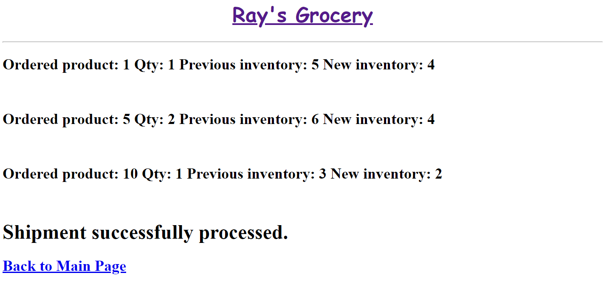
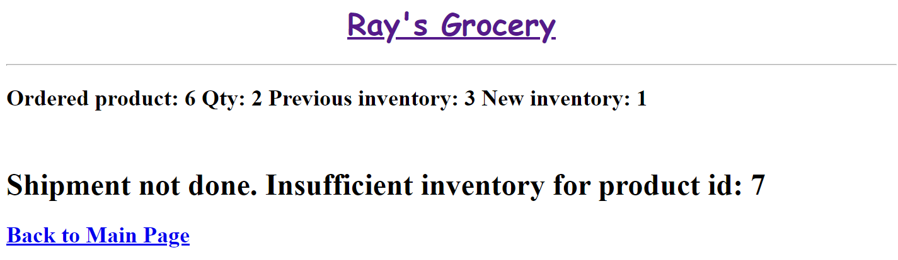

# COSC 304 - Introduction to Database Systems Lab 8: Images, Security, and Transactions

Modify your existing project web site with new features including a product detail page, a login feature, an administrator page, and support for transactions.

## Project Requirements (25 marks)

1. [Sample web site](https://cosc304.ok.ubc.ca/rlawrenc/tomcat/lab8/index.jsp)

2. Start with the setup for lab 7 for either [Java](https://github.com/rlawrenc/cosc_304/blob/master/labs/lab7/java/assign/setup), [PHP](https://github.com/rlawrenc/cosc_304/blob/master/labs/lab7/php/assign/setup), or [Node.js](https://github.com/rlawrenc/cosc_304/blob/master/labs/lab7/nodejs/assign/setup). **If you have an existing Docker container for lab 7, you do not need to download and setup lab 7 again.**

3. Download starter code for [Java](304_lab8_java.zip), [PHP](304_lab8_php.zip), or [Node.js](304_lab8_starter_node.zip). These code files should be **ADDED** to your existing lab 7 project. There is a new main page (`index.jsp/php`), an administrator page (`admin.jsp/php`), and images in the `img` folder. The four new code files to change: `validateLogin.jsp/php`, `product.jsp/php`, `admin.jsp/php`, and `ship.jsp/php`.

4. Your output does not have to look exactly like the sample (feel free to make it look better!).

The product page will show details on the product including images. An image can be retrieved from a local folder using a URL or stored as a binary object in the database.

#### Marking Guide (product page): (10 marks)

- **+1 mark** - for modifying product listing page to go to product detail page when click on product name
- **+3 marks** - for using PreparedStatement to retrieve and display product information by id
- **+2 marks** - for displaying an image using an HTML `img` tag based on `productImageURL` field
- **+3 marks** - for displaying an image from the binary field `productImage` by providing an `img` tag and modifying the `displayImage.jsp/php` file.
- **+1 mark** - for adding link to "add to cart" and to "continue shopping"

#### Screenshot

#### Marking Guide (admin and login page): (5 marks)

- **+1 mark** - for checking user is logged in before accessing page
- **+2 marks** - for displaying a report that list the total sales for each day. Hint: May need to use date functions like `year`, `month`, `day`.
- **+1 mark** - for displaying current user on main page (`index.jsp/php`)
- **+2 marks** - for modifying `validateLogin` to check correct user id and password

#### Screenshot

#### Marking Guide (customer page): (5 marks)

- **+1 mark** - for displaying error message if attempt to access page and not logged in
- **+4 marks** - for retrieving customer information by id and displaying it

#### Screenshot

#### Marking Guide (shipment page): (5 marks)

- **+3 mark** -for using transactions to either process the shipment and ship all items (up to 3) or generate an error
- **+2 marks** - for checking that there is enough of each item to ship from the warehouse. Rollback transaction if any item does not have enough inventory.
- Test by entering URL like: http://localhost/shop/ship.jsp?orderId=1

#### Screenshot - Successful Shipment with orderId=1

#### Screenshot - Unsuccessful Shipment with orderId=3

# Submission

**If you do not demonstrate live to the TA in virtual office hours, please upload your code and a video clip demonstrating your working pages with the new features on Canvas.** Bonus marks available for early completion.
